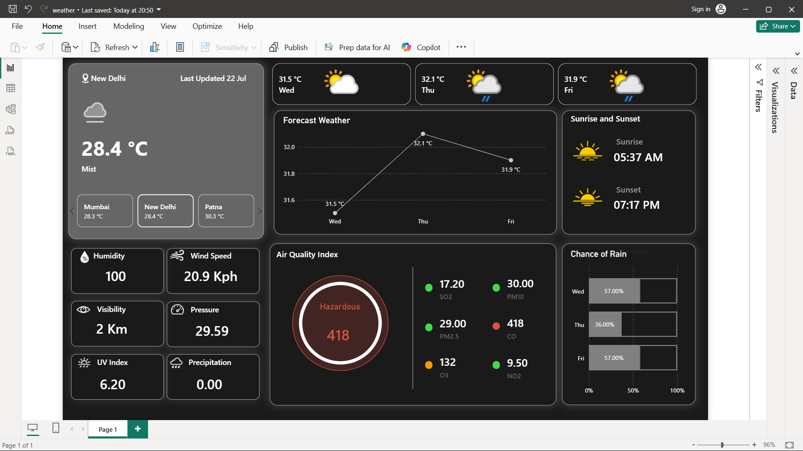

# 🌦️ Weather Dashboard – Power BI Project

An interactive Power BI dashboard that gives a real-time weather overview for a city, including current conditions, a 3-day forecast, air quality, sunrise/sunset times, and chance of rain.

## 📁 Project Contents 

| File | Description |
|------|--------------|
| `weather.pbix` | Main Power BI report file containing data model, Power Query (M) transformations, and report visuals |
| `Dashboard_screenshot.png` | Preview image of the dashboard |

## 📊 Dashboard Features

- **Current Conditions Card** – city name, last-updated timestamp, current temperature, and weather description (e.g., Mist), with quick-switch tabs for other cities (Mumbai, New Delhi, Patna)
- **3-Day Forecast Cards** – temperature and condition icons for the upcoming days (Wed, Thu, Fri)
- **Forecast Weather Line Chart** – temperature trend across the 3-day forecast
- **Sunrise and Sunset** – today's sunrise and sunset times
- **Air Quality Index (AQI)** – gauge showing overall air quality status (e.g., Hazardous) plus individual pollutant levels: SO2, PM10, PM2.5, CO, O3, NO2
- **Chance of Rain** – 100% stacked bar chart showing rain probability by day
- **Key Metrics Cards** – Humidity, Wind Speed, Visibility, Pressure, UV Index, and Precipitation

## 🛠️ Requirements

- [Power BI Desktop](https://powerbi.microsoft.com/desktop/) (latest version recommended)
- An active internet connection (the report pulls live weather data from a weather API)
- An API key for the weather data source, if required by your Power Query connection

## 🚀 How to Use

1. **Download** `weather.pbix` from this repository.
2. **Open** it in Power BI Desktop.
3. Refresh the data so the report reflects current, up-to-date weather information (see the important note below).
4. Use the city tabs (Mumbai / New Delhi / Patna) to switch between locations.

## ⚠️ Important: Refresh the Data Before Use

> **This dashboard does not auto-refresh when opened.** To ensure you're viewing the latest weather data (and not a stale snapshot saved with the file), you must refresh it manually, **twice, in this order**:
>
> 1. Open **Power Query Editor** (`Home → Transform Data`) and click **Refresh Preview** (or **Refresh All**) to update the underlying queries.
> 2. Close and apply the Power Query Editor, then go back to the **main report/dashboard view** and click **Refresh** (`Home → Refresh`) again to push the updated data into the visuals.
>
> Skipping either step may leave you looking at outdated data cached from when the file was last saved.

## 📌 Notes Future Improvements

- Update the data source connection details (API endpoint/credentials) in Power Query if you're pointing this report to your own weather data feed.
- Feel free to fork and customize the visuals or add new pages for additional insights.
- It is made just to show how we can create a weather forecast dashboard for multiple days and cities.
- I have just showed for next two days for 9-10 cities, you can get more data for more cities by using any weather api key.
- I used api key from this [website](https://www.weatherapi.com/).

## 📈 Future Improvements

- 7-Day Forecast.
- City Selection Slicer.
- Mobile Responsive Layout.
- Additional KPI Cards.
- Historical Weather Trends.
- Weather Alerts.
  
## 📄 License

Add your preferred license here (e.g., MIT).
